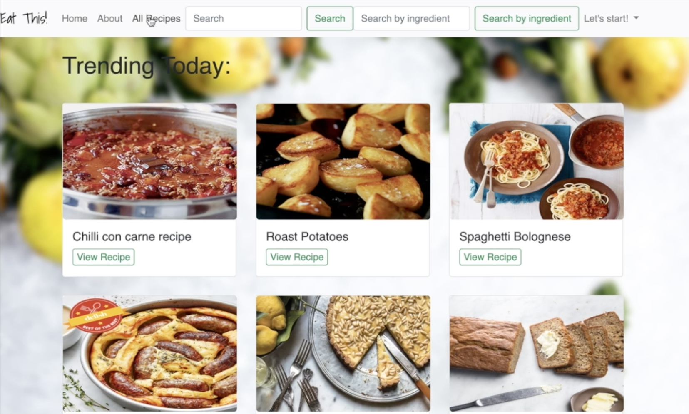
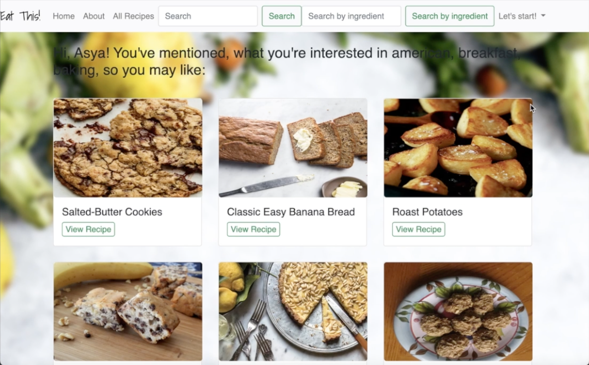

<h1 align="center">
  <a href="https://github.com/asya-code/EatThis.git">
    <!-- Please provide path to your logo here -->
    
Eat This!

  </a>
</h1>

 

Table of Contents

- [About](#about)
  - [Built With](#built-with)
- [Getting Started](#getting-started)
  - [Prerequisites](#prerequisites)
  - [Installation](#installation)
- [Usage](#usage)
- [Roadmap](#roadmap)
- [Support](#support)

---

## About

EatThis - a smart recipe application which allows you to create, edit, favorite, and search for new recipes. This app has recommendation algorithms which consider the user's food preferences.

Screenshots

 

|                               Trending recipes                               |                               Recommendations Page                               |
| :-------------------------------------------------------------------: | :--------------------------------------------------------------------: |

  |

### Built With

> **[?]**
The backend is powered by Python with Flask web framework and SQLAlchemy as its ORM, PostgreSQL for database. The front-end is written in HTML, Jinja and Javascript. Bootstrap and css were used to style the app.

## Getting Started

### Prerequisites

> **[?]**
> What are the project requirements/dependencies?

### Installation

> **[?]**
> Describe how to install and get started with the project.

## Usage

> **[?]**
> How does one go about using it?
> Provide various use cases and code examples here.

## Roadmap

Project starts on 03.14.2022, ends on Steps:

MVP
- Users can create a profile and log in
- Users can Store their own recipes - ingredients and steps, pictures (cloudinary API)
- Users can save favorite recipes

2.0
- Users can look for a new recipes by:
    Name
    Cousine
    Ingredients
- Recommendations available based on:
    Most used recipes
    Favorite cousine
    Trending

3.0
- Long term meal planning
- Meal Planning recommendations and suggestions
- Recipes recalculations according to a family/group size

Nice-to-haves
- Dietary adjustment to whole MPV
- Calories/nutritions calculator based recommendations

Main data will come from the static database, working on how to implement dynamic update of the database from online sources