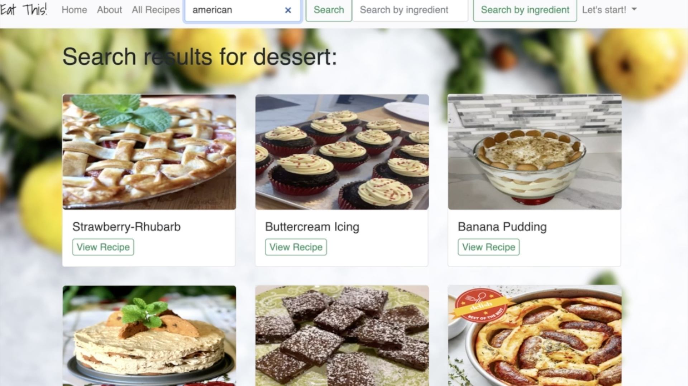
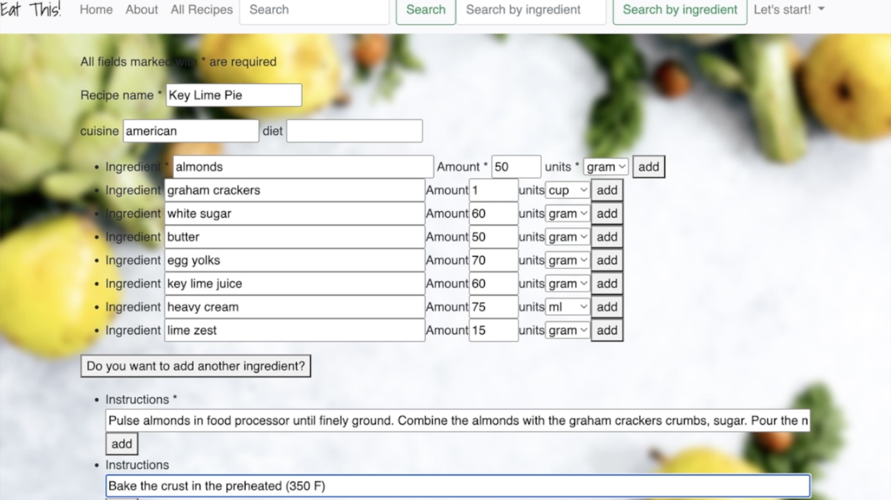
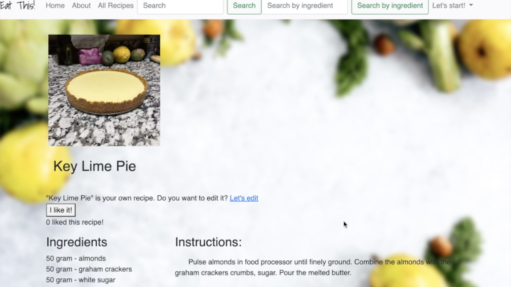
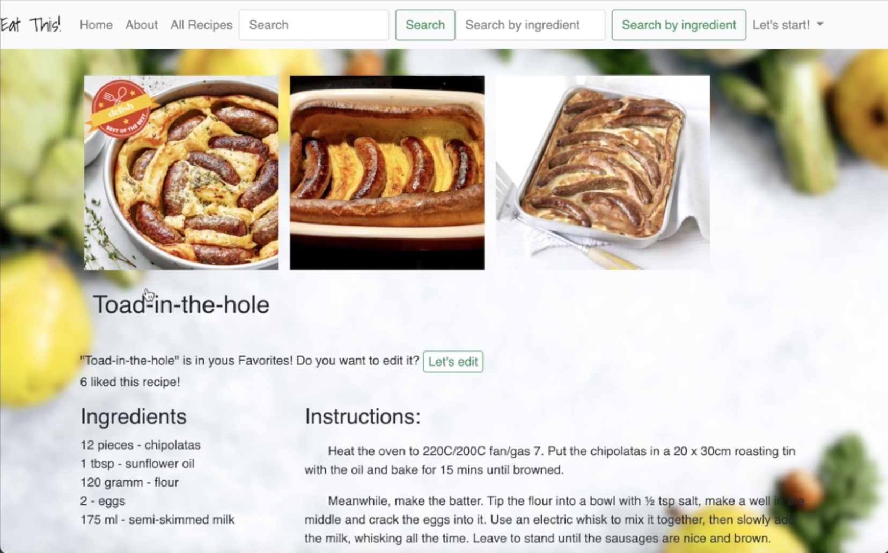

<h1 align="center">
  <a href="https://github.com/asya-code/EatThis.git">
    <!-- Please provide path to your logo here -->
    
Eat This!

  </a>
</h1>

 

Table of Contents

- [About](#about)
  - [Built With](#built-with)
- [Features](#features)
- [Getting Started](#getting-started)
  - [Installation](#installation)
  - [Launch your server](#launch-your-server)

- [Roadmap](#roadmap)

---

## About

&nbsp EatThis - a smart recipe application which allows you to create, edit, favorite, and search for new recipes. This app has recommendation algorithms which consider the user's food preferences.

 

 
 
 

### Built With

Backend is powered by Python with Flask web framework and SQLAlchemy as its ORM, PostgreSQL for database. The front-end is written in HTML, Jinja and Javascript. Bootstrap and css were used to style the app.

## Features

&nbsp Unregistered guests can see the most popular recipes, browse all recipes and search particular ones by cuisine/diet/recipe name or ingredient.  After search button is pressed, request is send into my flask server which picks corresponding recipes from the database and sends them to the search results page.

 

 

&nbsp Logged in users can add their own recipes with my “add new recipe” feature, that support multiple ingredients and instructions input and images attachment. Images are stored via Cloudinary API.  These recipes are private by default user can choose to publish it to the website too. On the backend Flasks creates a recipe and stores it in the database. 

 

 

&nbsp When recipe was successfully submitted, user will be redirected to this recipe page immediately.

 

 

&nbsp Users also can add recipes to their favorites, I’ve used Javascript to implement this without reloading the page. Every favorite recipe can be modified according to user’s preferences, the amount of recipe variations is unlimited.

 

 

&nbsp Another feature of my app is recipe recommendations based on user’s preferences.

 

## Getting Started

### Installation

Retrieve an entire repository from a hosted location via URL
 

 &nbsp <b> git clone https://github.com/asya-code/EatThis.git </b> 

You’d then create a virtual environment:

 &nbsp <b> virtualenv env </b> 

Next, you’d activate that environment:
 

 &nbsp <b> source env/bin/activate </b> 

Finally, you’d use pip3 to install all of the requirements:
 

 &nbsp <b> (env) $ pip3 install -r requirements.txt </b> 

The -r option lets you supply a text file in the format pip3 freeze produces. This command should install all of the listed libraries.

To confirm that the correct packages are installed, you’d just run:
 

 &nbsp <b> pip3 freeze </b> 

### Launch your server

Once you’ve set up your virtual environment, activated it, and installed Flask, you should just be able to type:
 

 &nbsp <b> python3 server.py </b> 

## Roadmap

Project starts on 03.14.2022, ends on Steps:

MVP
- Users can create a profile and log in
- Users can Store their own recipes - ingredients and steps, pictures (cloudinary API)
- Users can save favorite recipes

2.0
- Users can look for a new recipes by:
    Name
    Cousine
    Ingredients
- Recommendations available based on:
    Most used recipes
    Favorite cousine
    Trending

3.0
- Long term meal planning
- Meal Planning recommendations and suggestions
- Recipes recalculations according to a family/group size

Nice-to-haves
- Dietary adjustment to whole MPV
- Calories/nutritions calculator based recommendations

Main data will come from the static database, working on how to implement dynamic update of the database from online sources